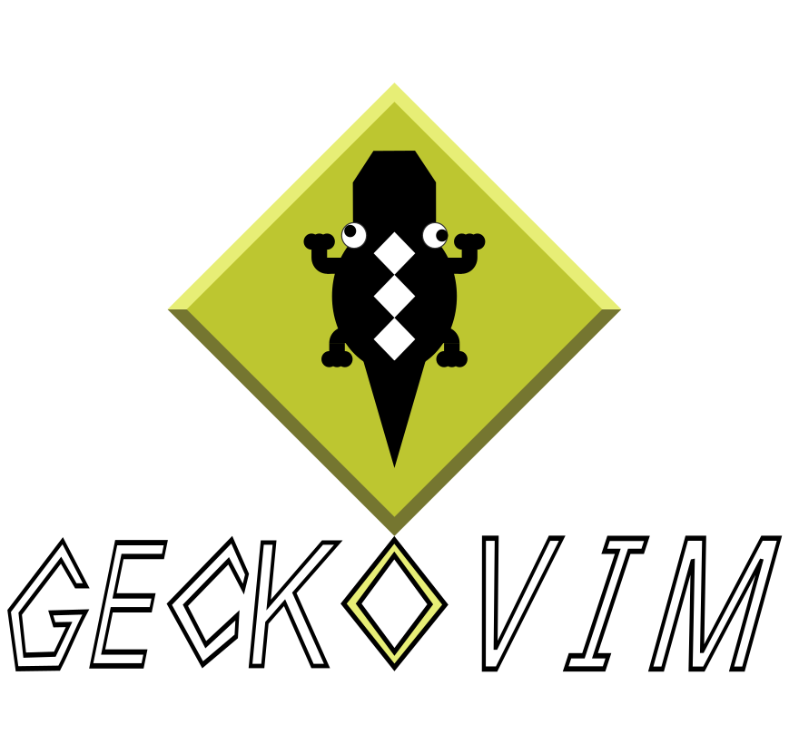

# GeckoVim
<div align="center" style="background-color: #000000; padding: 20px;">

</div>

A simple vim distribution for programmers.

# Why GeckoVim?

Gecko Vim follows the **KISS** (Keep It Simple, Stupid) principle. It provides a clean configuration with the essential functionality you expect from a modern code editor.

Once Gecko Vim is installed, I invite you to customize it however you like. Add plugins, remove features, remap keys, or adapt it to your workflow. Gecko Vim is designed to be a starting point, not a limitation.

---

## Gecko Vim (Classic Vim)

### Dependencies

#### 1. Vim

It is highly recommended to install **gVim**, which also includes terminal Vim.

**Debian / Ubuntu**

```bash
sudo apt update && sudo apt install vim-gtk3
```

**Arch Linux**

```bash
sudo pacman -S gvim
```

**Fedora**

```bash
sudo dnf install vim-enhanced
```

#### 2. vim-plug

Install the plugin manager:

```bash
curl -fLo ~/.vim/autoload/plug.vim --create-dirs \
https://raw.githubusercontent.com/junegunn/vim-plug/master/plug.vim
```

> More info: [https://github.com/junegunn/vim-plug](https://github.com/junegunn/vim-plug)

#### 3. Nerdfont
Download a nerdfont to get icons for vim-devicons plugin in vim
Go to the link
[https://www.nerdfonts.com/](https://www.nerdfonts.com/)

#### 4. Node.js

Required for **coc.nvim** (IntelliSense, linting, etc.).

Install it from the official site (Recommended): [https://nodejs.org/es/download](https://nodejs.org/es/download)

Or using your package manager:

```bash
# Debian / Ubuntu
sudo apt install nodejs npm
```

```bash
# Arch Linux
sudo pacman -S nodejs npm
```

```bash
# Fedora
sudo dnf install nodejs npm
```

#### 5. Need Go and make? (optional)

Needed for one plugin "vim-hexokinase" (this provides highlight for css colors). If you don't want this plugin, you can skip this step.

> **Note:** If you don't install Go, make sure to remove "Plug 'RRethy/vim-hexokinase', { 'do': 'make hexokinase' }" from the file plugins.vim after installation.

**Arch Linux**

```bash
sudo pacman -S go make
```

**Debian / Ubuntu**

```bash
sudo apt install golang-go make
```

**Fedora**

```bash
sudo dnf install golang make
```

### Installation

#### 1. Clone and install

> **Warning:** This will overwrite your existing `~/.vimrc`. Backup it first if needed.

```bash
# HTTP
git clone https://github.com/qwerty3341/geckovim.git \
&& mv geckovim/VimEdition/{config,maps,plugin-config,plugins}.vim ~/.vim/ \
&& rm -rf geckovim \
&& ln -sf ~/.vim/config.vim ~/.vimrc
```

```bash
# SSH
git clone git@github.com:Qwerty3341/GeckoVim.git \
&& mv GeckoVim/VimEdition/{config,maps,plugin-config,plugins}.vim ~/.vim/ \
&& rm -rf GeckoVim \
&& ln -sf ~/.vim/config.vim ~/.vimrc
```

### Post Installation
#### 1. Install plugins

Open Vim and run:

```
:PlugInstall
```

#### 2. Check for the comment mappings
GeckoVim use a few commands to comment lines, yet also has the map "Ctrl /" for simple comment.
1. Go to `~/.vim/plugin-config.vim` and search for the NERDCommenter plugin config
2. Move to the line "" Keymaps for use ctrl / ..."
3. Execute this command in command mod: `:echo getcharstr()`
4. If it returns `^_` you must uncomment these lines
    ```vim
    " nnoremap <C-_> :call nerdcommenter#Comment('n', 'toggle')<CR>
    " xnoremap <C-_> :call nerdcommenter#Comment('x', 'toggle')<CR>gv
    " inoremap <C-_> <C-o>:call nerdcommenter#Comment('n', 'toggle')<CR>
    ```

5. Otherwise if the command returns `\` uncomment these lines
    ```vim
    " nnoremap <C-/> :call nerdcommenter#Comment('n', 'toggle')<CR>
    " xnoremap <C-/> :call nerdcommenter#Comment('x', 'toggle')<CR>gv
    " inoremap <C-/> <C-o>:call nerdcommenter#Comment('n', 'toggle')<CR>
    ```

#### 3. Install the completions for your languages
GeckoVim uses "coc.nvim" that is a plugin to provide intelliSense and completions. 

Here are some examples:

(Run this commands inside Vim in command mode)
```vim
# Python
:CocInstall coc-pyright 

# Java
:CocInstall coc-java

# Rust
:CocInstall coc-rust-analyzer

# C/C++/Objetive C
:CocInstall coc-clangd

# JS/TypeScript
:CocInstall coc-tsserver

# HTML
:CocInstall coc-html

# CSS
:CocInstall coc-css

# Markdown
:CocInstall coc-markdownlint
```

If some language does not appear you can check the coc.nvim documentation:

[https://github.com/neoclide/coc.nvim/wiki/Using-coc-extensions](https://github.com/neoclide/coc.nvim/wiki/Using-coc-extensions
)


#### 4. Install LazyGit (optional)
LazyGit is a CLI client for git, GeckoVim provides `<leader> g` to open LazyGit inside Vim

Go to the link
[https://lazygit.dev/](https://lazygit.dev/)


#### 5. Install OpenCode (optional)
OpenCode is a open source AI agent for programming.
GeckoVim provides `<leader> o` to use OpenCode inside Vim.
However this map is just in case you don't want to use Tabs in the terminal and want to use OpenCode inside Vim

Go to the link
[https://opencode.ai/es](https://opencode.ai/es)

---

## Slim Gecko

A lightweight version of GeckoVim focused on secondary editor or server administration.

### Installation

1. Download vim (The version you want)

**Debian / Ubuntu**
```bash
sudo apt update && sudo apt install vim-gtk3
```

**Arch Linux**
```bash
sudo pacman -S gvim
```

**Fedora**
```bash
sudo dnf install vim-enhanced
```

2. Copy the configuration

> **Warning:** This will overwrite your existing `~/.vimrc`. Backup it first if needed.

```bash
### HTTP
git clone https://github.com/qwerty3341/geckovim.git \
    && cp geckovim/SlimGecko/config.vim ~/.vimrc \
    && rm -rf geckovim
```

```bash
### SSH
git clone git@github.com:Qwerty3341/GeckoVim.git \
    && cp GeckoVim/SlimGecko/config.vim ~/.vimrc \
    && rm -rf GeckoVim
```

---


## Neovim Edition

> Coming soon.

A Neovim-native version of GeckoVim.
